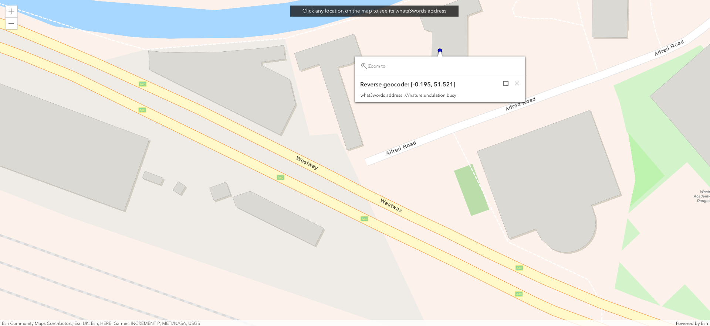

# What3words ArcGIS API for JavaScript - Convert To 3 words

This repo demonstrates how to use [What3words ArcGIS Locator](https://developer.what3words.com/tools/gis-extensions/arcgis) with the [AMD modules via ArcGIS CDN](https://developers.arcgis.com/javascript/latest/install-and-set-up/).

## The advantages of using the CDN(AMD) include:

    Fast download and highly optimized caching for the API modules;
    No installation or configuration;
    Easy to update applications to the next API version.

## Get Started

**Step 1** - If you are new to ArcGIS start with the [mapping APIs and location services guide](https://developers.arcgis.com/documentation/mapping-apis-and-services/).

**Step 2** - Get `what3words API key` 
**Step 4** - Replace the following environemnt variables with yours:

    username: "YOUR-W3W-EMAIL-ADDRESS", 
    password: "YOUR-W3W-API-KEY", 

**Step 5** - Open `index.html` in any browser to display it

A screenshot of how the app should look like:

