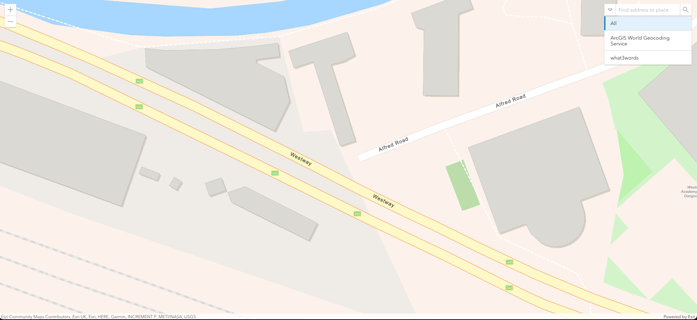

# What3words ArcGIS API for JavaScript with webpack

This repo demonstrates how to use [`What3words ArcGIS Locator`](https://developer.what3words.com/tools/gis-extensions/arcgis) with the [`@arcgis/core`](https://www.npmjs.com/package/@arcgis/core) ES modules with webpack.


## Known Issues
- `webpack-dev-server` had a [breaking change](https://github.com/webpack/webpack-dev-server/blob/master/CHANGELOG.md#-breaking-changes-4) in `4.0.0` which removed `contentBase` in favor of the `static` option. This sample has been changed accordingly.

## Get Started

**Step 1** - Run `npm install` and then start adding modules.

**Step 2** Configure CSS. Here's a basic CSS example:

*index.css*

```css
@import 'https://js.arcgis.com/4.21/@arcgis/core/assets/esri/themes/light/main.css';
```
**Step 3** - Get `what3words API key` 
**Step 4** - Create an `.env` file to host your private environment variables, use the `.env.example` as a template

For additional information, see the [Build with ES modules](https://developers.arcgis.com/javascript/latest/es-modules/) Guide topic in the SDK.

## Commands

For a list of all available `npm` commands see the scripts in `package.json`.

To build the project after installing it run `npm run build`

To run the project type on the command line `npm run start`

## Extra
A screenshot of how the app should look like:


